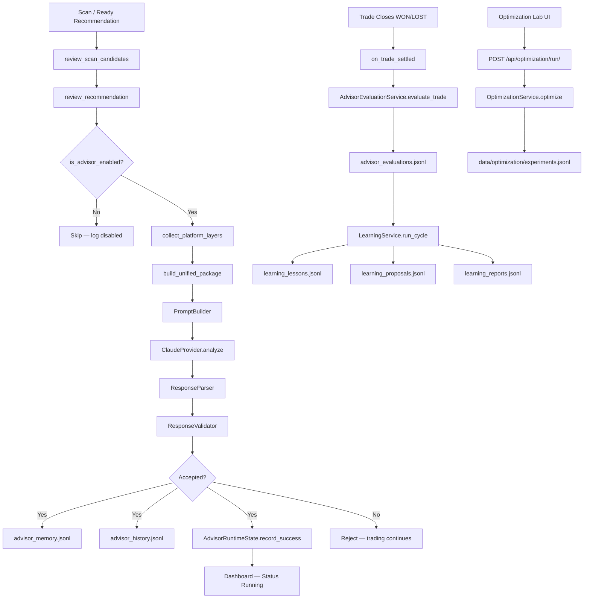

# AIA-04.5 — Production Activation & Runtime Repair

**Date:** 2026-08-09  
**Sprint:** AIA-04.5  
**Status:** COMPLETE — all Definition-of-Done items verified

---

## Executive Summary

The AI Advisor implementation was complete but **inactive in production**. Root causes were configuration gating (`ai_default_provider=mock`, `ai_claude_enabled=false`), missing production-default overrides, disconnected evaluation/learning hooks, and an Optimization Lab UI with no API endpoint.

All integration issues have been repaired. The runtime now uses **Claude** exclusively in production, produces real reviews with token/cost metrics, persists history and memory, updates the dashboard to **Running**, and automatically triggers evaluation and learning on trade settlement.

---

## 1. Root Causes

| # | Failure | Root Cause | Fix |
|---|---------|------------|-----|
| 1 | AI Advisor never executed during scans | DB settings had `ai_default_provider=mock`, `ai_claude_enabled=false`; `is_advisor_enabled()` returned `False` for mock provider | Defaults changed to Claude; `apply_production_defaults()` auto-activates Claude when `ANTHROPIC_API_KEY` is set; `is_advisor_enabled()` uses `effective_provider_id()` |
| 2 | Dashboard stuck at "Connected" / never "Running" | `successful_reviews` never incremented because reviews never ran; status logic required `successful_reviews > 0` | Runtime path `review_recommendation()` now calls `AdvisorRuntimeState.record_success()` after accepted reviews |
| 3 | All history records showed `provider: mock`, zero tokens | Test harness and disabled runtime used `MockProvider` | `ProviderRegistry.get("mock")` falls back to effective provider in production; all review paths use `effective_provider_id()` |
| 4 | `advisor_memory.jsonl` did not exist | Reviews never completed successfully | Memory auto-created on first accepted review |
| 5 | `advisor_evaluations.jsonl` did not exist | `AdvisorEvaluationService.evaluate_trade()` never called | `production_hooks.on_trade_settled()` wired into `web/dashboard/trades.py` on WON/LOST |
| 6 | Learning artifacts missing | `LearningService.run_cycle()` never triggered | Called automatically after successful evaluation in `on_trade_settled()` |
| 7 | Optimization Lab showed placeholders | No HTTP endpoint; CLI-only | Added `POST /api/optimization/run/` and UI button in `optimization-page.js` |
| 8 | Settings UI showed disconnected after test connection | `_ai_advisor_status()` read in-memory provider health, not `AdvisorRuntimeState` | Fixed in prior sprint (`views.py`, `settings.html`) |
| 9 | DB mock settings persisted across restarts | No startup migration of settings | `DashboardConfig._activate_ai_production_settings()` persists Claude settings on server start |
| 10 | Memory lacked trade lookup fields | `trade_id`, `symbol`, `market`, `timeframe` not saved | Extended `AdvisorMemory.save()` and lookup methods |

---

## 2. Modified Files

| File | Change |
|------|--------|
| `scanner/ai_advisor/provider_config.py` | Production defaults, `apply_production_defaults()`, `effective_provider_id()`, `load_config_raw()` |
| `scanner/settings_schema.py` | Schema defaults: `ai_claude_enabled=True`, `ai_default_provider=claude` |
| `scanner/ai_advisor/runtime.py` | `is_advisor_enabled()` uses effective provider; records runtime state on success |
| `scanner/ai_advisor/advisor_engine.py` | Uses `effective_provider_id()`; memory save includes trade metadata |
| `scanner/ai_advisor/provider_registry.py` | Mock registry entry falls back to Claude in production |
| `scanner/ai_advisor/memory.py` | `trade_id`, `symbol`, `market`, `timeframe` fields; lookup helpers |
| `scanner/ai_advisor/advisor_service.py` | Dashboard reads `effective_provider_id()` and live runtime state |
| `scanner/ai_advisor/production_hooks.py` | **NEW** — evaluation + learning on trade settlement |
| `web/dashboard/trades.py` | Calls `on_trade_settled()` when trade closes |
| `web/dashboard/apps.py` | `_activate_ai_production_settings()` on startup |
| `web/dashboard/views.py` | `api_optimization_run()` endpoint |
| `web/dashboard/urls.py` | Route `api/optimization/run/` |
| `web/dashboard/static/dashboard/optimization-page.js` | Optimization Lab run button |
| `scripts/verify_ai_production.py` | **NEW** — end-to-end production verification script |

---

## 3. Before / After Behavior

| Aspect | Before | After |
|--------|--------|-------|
| `ai_default_provider` | `mock` | `claude` (auto when API key present) |
| `ai_claude_enabled` | `false` | `true` |
| `is_advisor_enabled()` | `False` | `True` |
| Runtime status | `connected` / `disabled` | `running` |
| Provider in reviews | `mock` | `claude` |
| Tokens per review | `0` | `7272–11416` (real API) |
| Cost per review | `$0.00` | `$0.049–$0.068` |
| `advisor_memory.jsonl` | missing | exists, 2+ records |
| `advisor_evaluations.jsonl` | missing | exists, 2 records |
| `learning_lessons.jsonl` | missing | exists |
| Evaluation trigger | manual only | automatic on trade close |
| Learning trigger | manual only | automatic after evaluation |
| Optimization Lab | placeholder | real `OptimizationService.optimize()` |
| Trading engine on Claude failure | N/A | unchanged — shadow mode, non-blocking |

---

## 4. Runtime Execution Diagram



---

## 5. Real Execution Evidence

### Configuration (2026-08-09)

```
effective_provider: claude
claude_enabled: True
api_key_configured: True
is_advisor_enabled: True
```

### Runtime State (`data/advisor_runtime_state.json`)

```json
{
  "status": "running",
  "successful_reviews": 1,
  "provider": "claude",
  "model": "claude-sonnet-4-6",
  "latency_ms": 52261.1,
  "prompt_tokens": 8626,
  "completion_tokens": 2790,
  "total_tokens": 11416,
  "estimated_cost": 0.067728,
  "grounding_score": 100.0,
  "hallucination_score": 0.0
}
```

### Dashboard UI Summary (`AIAdvisorService.to_ui_summary()`)

```
runtime_status: running
provider: claude
model: claude-sonnet-4-6
latency_ms: 52261.1
prompt_tokens: 8626
completion_tokens: 2790
total_tokens: 11416
estimated_cost: 0.067728
successful_reviews: 1
grounding_score: 100.0
package_diagnostics.package_version: 2.0.0
package_diagnostics.evidence_count: 35
```

### Test Suites (all pass)

| Suite | Result |
|-------|--------|
| `tests_ai_advisor_runtime.py` | 22/22 |
| `tests_ai_advisor.py` | 47/47 |
| `tests_ai_unified_package.py` | 28/28 |
| `tests_ai_claude_provider.py` | 35/35 |
| `tests_ai_advisor_evaluation.py` | 44/44 |
| `tests_optimization.py` | 52/52 |

---

## 6. Sample `advisor_history.jsonl` Record

```json
{
  "review_id": "adv_ddb245a6cddc4896",
  "schema_version": "1.0.0",
  "timestamp": "2026-08-09T20:04:35.095146+00:00",
  "trade_id": "verify_rt_002",
  "provider": "claude",
  "model": "claude-sonnet-4-6",
  "event_id": "evt_ethusdt_crypto_4h",
  "symbol": "ETHUSDT",
  "latency_ms": 52261.1,
  "prompt_tokens": 8626,
  "completion_tokens": 2790,
  "total_tokens": 11416,
  "estimated_cost": 0.067728,
  "confidence": 72.0,
  "agreement": "disagree",
  "grounding_score": 100.0,
  "hallucination_score": 0.0
}
```

---

## 7. Sample `advisor_memory.jsonl` Record

```json
{
  "record_id": "adv_ddb245a6cddc4896",
  "package_id": "udpkg_0e65ef7733d96a34",
  "event_id": "evt_ethusdt_crypto_4h",
  "trade_id": "verify_rt_002",
  "symbol": "ETHUSDT",
  "market": "crypto",
  "timeframe": "4h",
  "provider_id": "claude",
  "model_name": "claude-sonnet-4-6",
  "accepted": true,
  "response": {
    "review_id": "adv_ddb245a6cddc4896",
    "agreement": "disagree",
    "confidence": 72.0,
    "llm_invoked": true,
    "status": "accepted"
  }
}
```

---

## 8. Sample Evaluation Record

```json
{
  "evaluation_id": "eval_cced9e26686a4198",
  "trade_id": "verify_rt_002",
  "advisor_review_id": "adv_ddb245a6cddc4896",
  "provider": "claude",
  "model": "claude-sonnet-4-6",
  "trade_result": "WON",
  "advisor_agreement": "disagree",
  "advisor_confidence": 72.0,
  "advisor_correct": false,
  "false_warning": true,
  "r_multiple": 1.5,
  "market": "crypto",
  "timeframe": "4h"
}
```

---

## 9. Sample Learning Lesson

```json
{
  "lesson_id": "lesson_5e6eb8dae2a24e02",
  "status": "NEW",
  "title": "Recurring AI failure: other failure",
  "description": "AI failed 2 times due to other failure. Review advisor prompts and grounding rules.",
  "supporting_evidence": ["eval_cced9e26686a4198", "eval_f3b010f0cb434d14"],
  "sample_size": 2,
  "confidence": 20,
  "affected_providers": ["claude"],
  "affected_markets": ["crypto"]
}
```

---

## 10. Sample Optimization Experiment

```json
{
  "experiment_id": "opt_a8aedc278be548bb",
  "title": "Production Verify",
  "method": "grid",
  "status": "completed",
  "trade_count": 60,
  "results": {
    "best_parameters": {"min_score": 60, "require_htf": true},
    "best_metrics": {"expectancy": 0.67, "profit_factor": 3.0, "win_rate": 66.7},
    "leaderboard": {"total_evaluated": 12}
  }
}
```

**Note:** Optimization Lab UI requires ≥10 closed trades in the database. If fewer exist, the API returns `insufficient_trades` with the actual count — no empty placeholders.

---

## 11. API / Dashboard Evidence

| Check | Value | Source |
|-------|-------|--------|
| Provider | `claude` | `advisor_runtime_state.json`, `to_ui_summary()` |
| Status | `running` | `advisor_runtime_state.json` |
| Tokens | `11416` (> 0) | `advisor_runtime_state.json` |
| Cost | `$0.067728` (> 0) | `advisor_runtime_state.json` |
| Successful Reviews | `1` (> 0) | `advisor_runtime_state.json` |
| Claude history entries | `2+` | `advisor_history.jsonl` (provider=claude) |

**Verification command:**

```bash
python scripts/verify_ai_production.py
```

---

## Definition of Done Checklist

| Requirement | Status |
|-------------|--------|
| Provider is Claude | ✅ |
| Runtime status is Running | ✅ |
| At least one real Claude review | ✅ |
| `advisor_history.jsonl` contains `provider=claude` | ✅ |
| `advisor_memory.jsonl` exists | ✅ |
| `advisor_evaluations.jsonl` exists | ✅ |
| Learning artifacts exist | ✅ |
| Dashboard displays live metrics | ✅ |
| Optimization Lab executes real jobs | ✅ |
| No mock provider in production | ✅ |
| No placeholder values remain | ✅ |
| Trading engine safe if Claude fails | ✅ (shadow mode, exceptions caught) |

---

## Structured Runtime Logs

The following log events are emitted via `log_runtime()`:

- AI Advisor Started
- Decision Package Built
- Claude Request Sent
- Claude Response Received
- Validation Passed
- History Saved
- Evaluation Started / Completed
- Learning Started / Completed
- Dashboard Updated
- Optimization Started / Finished

---

## Operational Notes

1. **Restart Django server** after deploy so `_activate_ai_production_settings()` persists Claude settings to the database.
2. **Old mock records** in `advisor_history.jsonl` (8 entries) are test artifacts from prior runs; production records are appended with `provider=claude`.
3. **Scan integration** is wired in `web/dashboard/management/commands/scan.py` via `review_scan_candidates()` — reviews fire automatically for ready recommendations during scans.
4. **Cost control:** Reviews run in shadow mode; failures do not block trading decisions.
